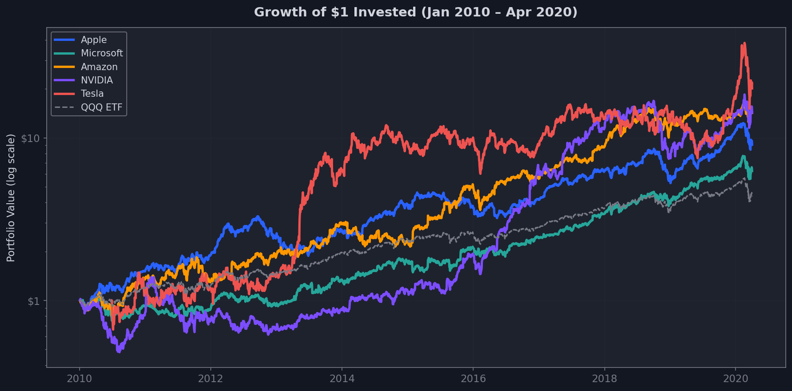
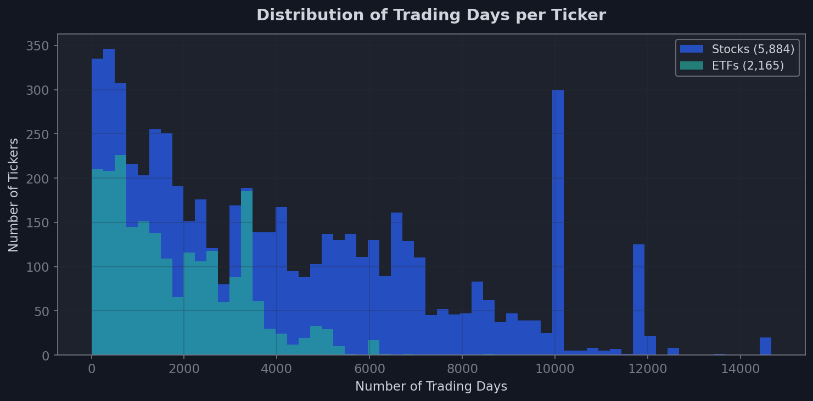
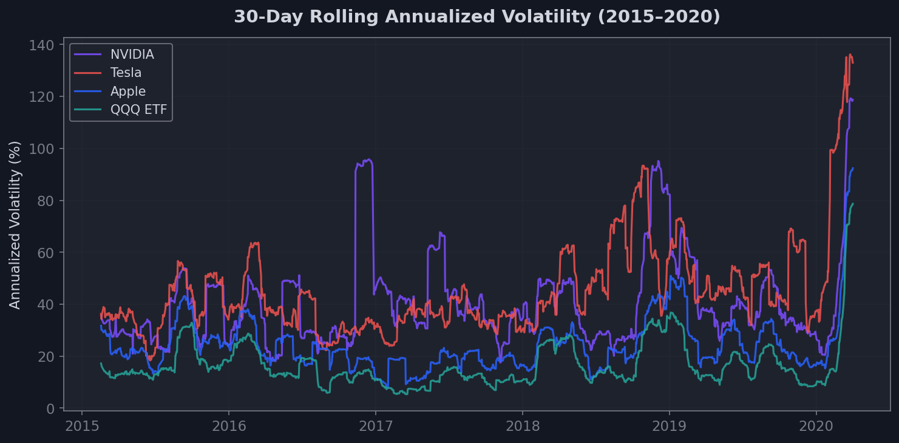

# 📈 StocksWise

**A beginner-friendly, data-driven guide to investing on the NASDAQ.**  
Learn key financial concepts, explore real market data, and simulate your own investment strategies.

🌐 **Deep Dive in the Finance World Now**  
https://com-480-data-visualization.github.io/StocksWise/

## 👨‍💻 Team

| Name | SCIPER |
|-----|-----|
| Gustave Lapierre | |
| Youssef Seddik | |
| Maxime Garambois | 346526 |

## 🚀 Project Milestones

[**Milestone 1**](#milestone-1) - [**Milestone 2**](#milestone-2) - [**Milestone 3**](#milestone-3)

# Exploring the World of Finance

---

## Milestone 1  
**Deadline:** Friday, April 3rd – 17:00

### Dataset

**Main dataset**  
https://www.kaggle.com/datasets/jacksoncrow/stock-market-dataset

Back in the early 1980s, a vast financial record began taking shape. Sourced through Yahoo Finance and compiled by Oleh Onyshchak (Kaggle user jacksoncrow), the NASDAQ Stock Market Dataset tracks daily price movements for all NASDAQ-listed securities. Each ticker comes with structured CSV entries: Date, Open, High, Low, Close, Adjusted Close, and Volume. Coverage runs up to April 2020. We plan to extend it to 2025 by forking and re-executing the original collection script. The dataset is very complete, and all rows are relevant. This update will include critical market phases the 2022 sell-off triggered by rate hikes, and the surge in 2023,2024 fueled by AI enthusiasm. It’s a necessary step. Markets evolve. So should the data.

**Extended dataset**  
| Source | What it adds | How |
|---|---|---|
| FinanceDatabase | Sector & industry tags | CSV join on ticker |
| yfinance API | Company name, description | Python queries |
| FRED | Fed interest rates | Free API |
| VIX | Market fear index | Yahoo Finance |

**Data quality**
* Consistent CSV format (simple for parse)
* Missing values handled with forward-fill or row drop depending on gap size
* Adj Close mandatory for long-term comparisons (e.g. Apple's 2020 4-for-1 split distorts raw prices).

### ❓ Problematic

Existing platforms (Bloomberg, Yahoo Finance, Trade Republic) are built for experienced investors dense, jargon-heavy, and intimidating for beginners.

**Target audience:** students aged 18–25 with no financial background and more.

**Core questions:**
* What investment strategies exist, and what risk/reward does each carry?
* How have companies or sectors evolved on the NASDAQ over time?
* What would €1,000 invested in Apple in 2010 look like today?
* How do ETFs compare to individual stocks?
* What tools help users go further once they know the basics?

**StocksWise** guides beginners through investing via data storytelling.

**Core narrative:** "You have €1,000 what do you do?" The platform grows with the user through a two-mode architecture.

### 🔍 Exploratory Data Analysis

| Metric            | Value           |
| ----------------- | --------------- |
| Stock tickers     | 6,800 CSV files |
| ETF tickers       | 2,100 CSV files |
| Longest history   | 1980–2025       |
| Avg rows / ticker | 3,500           |
| Total rows        | 30 million      |

**Key observations:**
* Prices range from 1 to 500 dollars — normalization mandatory
* Volume spikes mark major crises: dot-com 2000, 2008, COVID 2020, rate hikes 2022.
* Tech (Apple, NVIDIA, Microsoft, Amazon, Meta, Alphabet) dominates by market cap and return.
* ETFs like QQQ are far smoother than individual growth stocks (Tesla, NVIDIA)
* NVIDIA surged +600% in 2023–2024 on AI hype, a compelling story for young audiences.

#### Growth of $1 Invested (2010–2020)
Tech giants vastly outperform the QQQ index. NVIDIA and Tesla show explosive but volatile growth, while QQQ offers a smoother ride, a key insight for beginners weighing risk vs. reward.

#### Dataset Coverage
Most tickers have 3,000–10,000 trading days of history. ETFs cluster tightly around the same range, while stocks show a wider spread, some IPO'd recently, others date back to the 1980s.

#### Volatility: Stocks vs. ETFs
Individual growth stocks (NVIDIA, Tesla) exhibit 2–4x the volatility of the QQQ ETF, confirming that diversified ETFs offer significantly smoother returns, a core lesson for our target audience.

**Preprocessing plan:** sector tagging (FinanceDatabase), price normalization, rolling metrics (MA 30d/200d, Sharpe, volatility), ML feature extraction, monthly aggregation for long-range views

### 📚 Related Works

| Tool                      | What they do                   | What's missing                    |
| ------------------------- | ------------------------------ | --------------------------------- |
| Yahoo Finance / Bloomberg | Comprehensive but expert-only  | No education, no personalization  |
| Trade Republic            | Simple trading app             | No visual explanation of concepts |
| NYT The Upshot            | Narrative-driven viz reference | Not finance-focused               |
| Morningstar               | Risk/return plots              | Not for beginners                 |

**Why we are original:**
- Only platform combining education + exploration + simulation + ML personalization for beginners.
- Two mode architecture is new: the app grows with the user.
- The "€1,000" narrative makes abstract concepts personal and memorable.

### 🔗 References
- [Information Is Beautiful](https://informationisbeautiful.net/)  
- [Flourish](https://flourish.studio/blog/visualizing-financial-data/)  
- [Public](https://public.com)  
- [The Pudding](https://pudding.cool)  
- [Our World in Data](https://ourworldindata.org)  
- [Morningstar](https://www.morningstar.com)  
- [TradingView](https://fr.tradingview.com)

## Milestone 2

## Milestone 3
